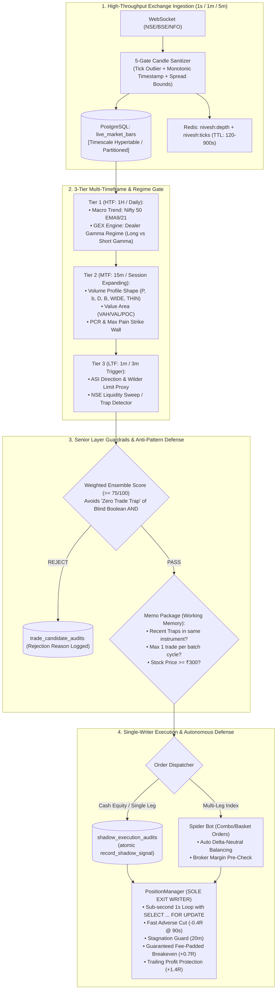
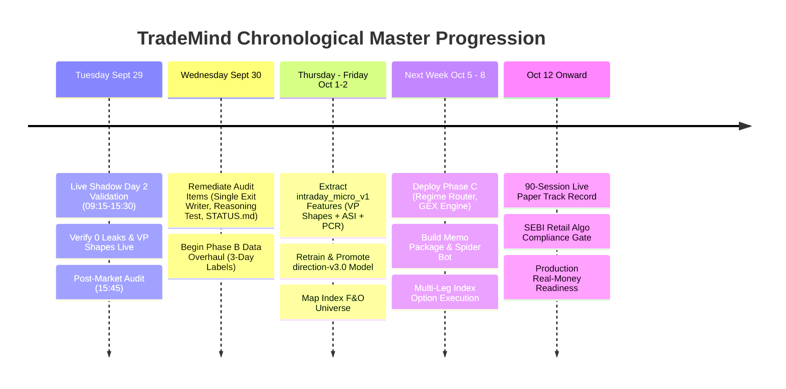

# Master Comprehensive Plan: TradeMind Unified Architecture & Execution Roadmap

*Document Version: 3.5.0 — Created: 2026-09-28 22:45 IST*  
*Scope: Complete Architecture, Audit Fixes, GEX/VP Systems, Phase B, Phase C & Chronological Execution*

---

## 1. Executive Blueprint & Architecture Overview

This master plan unites all architectural components, recent audit findings, risk defense mechanisms, and future phases into a single authoritative roadmap.



---

## 2. Immediate Hardening & Audit Remediations (Step 0)

From our forensic audit of the codebase, the following 6 structural issues must be resolved before Phase B data extraction begins:

### 2.1. Concurrency: Single-Writer Architecture Lock
* **Vulnerability Found**: [backend/live_inference.py](file:///Users/avinash/Documents/Codex/2026-06-27/design-a-modern-distinctive-ui-ux/backend/live_inference.py#L3119-L3120) runs `_manage_open_trade_risk()` and `_close_due()` concurrently with `PositionManager` running via Celery (`run_position_defense_loop`). Furthermore, [record_shadow_exit](file:///Users/avinash/Documents/Codex/2026-06-27/design-a-modern-distinctive-ui-ux/backend/ml/validation_engine.py#L180) did not check `WHERE net_pnl IS NULL`.
* **Remediation Plan**:
  1. In `live_inference.py`, deactivate `_manage_open_trade_risk` and `_close_due` during normal operation, establishing `PositionManager` as the **sole authority on trade exits**.
  2. In `record_shadow_exit()` (`validation_engine.py`), add an atomic condition:
     ```sql
     UPDATE shadow_execution_audits 
     SET realised_exit_price=:exit, net_pnl=:net, exit_at=:exit_at, exit_reason=:reason
     WHERE id=:id AND net_pnl IS NULL;
     ```
     If 0 rows are affected (already closed), return immediately without double-writing.

### 2.2. Test Suite Gaps (Closing the Blind Spots)
* **Vulnerability Found**: 0 tests in `tests/` verify dictionary round-trip into `:reasoning_chain::jsonb` or concurrency locks.
* **Remediation Plan**:
  1. Add `tests/test_audit_persistence_integration.py`:
     - Test inserting complex nested reasoning dictionaries, strategies, and audit notes into `shadow_execution_audits` and reading them back.
     - Test concurrency: Simulate two parallel worker threads attempting to call `record_shadow_exit()` on the same trade ID; assert exactly one succeeds and P&L is never overwritten.

### 2.3. Markdown Sprawl Consolidation
* **Vulnerability Found**: 20 loose `.md` files in the workspace root cause context confusion across development sessions.
* **Remediation Plan**:
  1. Create `docs/archive/` and archive legacy/dated reports (`V3_2_FULL_REPORT.md`, `ML_V2_5_REPORT.md`, `PROMOTION_ENGINE_V3_4_REPORT.md`, `REMAINING_PHASES_V3_7_REPORT.md`).
  2. Maintain exactly **3 active living markdown documents** at the root:
     - `STATUS.md`: The living single source of truth for runtime metrics, open positions, and session results.
     - `MASTER_COMPREHENSIVE_PLAN.md`: This comprehensive architecture and roadmap document.
     - `README.md`: Project quickstart, architecture diagram, and operational runbook.

### 2.4. Table Retention & TimescaleDB Partitioning
* **Vulnerability Found**: `live_market_bars` is an unpartitioned PostgreSQL table holding millions of bars, risking long-term query degradation.
* **Remediation Plan**:
  1. Create migration `migrations/postgres/v3_18_timescale_partitioning.sql`:
     - Convert `live_market_bars` to a TimescaleDB hypertable partitioned by `bar_time` in 7-day chunks (or native PostgreSQL range partitioning by month if Timescale extension is not installed):
       ```sql
       -- If TimescaleDB available:
       SELECT create_hypertable('live_market_bars', 'bar_time', chunk_time_interval => INTERVAL '7 days', if_not_exists => TRUE);
       ```
     - Add compression policy for chunks older than 30 days.

### 2.5. API Boundary Input Validation (Defense in Depth)
* **Vulnerability Found**: Order intents entering `/api/execution/intents` bypass HTTP-level schema checks and rely entirely on downstream `RiskEngine.evaluate()`.
* **Remediation Plan**:
  1. Define Pydantic / dataclass schemas in `backend/schemas.py`:
     - `quantity: int = Field(gt=0)`
     - `limit_price: Decimal = Field(gt=0)`
     - `stop_loss: Optional[Decimal]` (must be $< \text{price}$ for BUY, $> \text{price}$ for SELL).
  2. Return `HTTP 400 Bad Request` with exact validation errors at the API edge.

### 2.6. Scheduler Heartbeat & Alerting
* **Vulnerability Found**: No alert is dispatched if the Celery Beat scheduler daemon hangs before the 15-minute bar delay is noticed by Sentinel.
* **Remediation Plan**:
  1. In `worker.py`, every scheduler cycle updates a Redis key `nivesh:scheduler:heartbeat` with current UTC timestamp and 120s TTL.
  2. `SentinelWatcher` checks `nivesh:scheduler:heartbeat`. If expired ($> 120$s), immediately dispatches a high-priority alert via the Telegram/Discord notification dispatcher.

---

## 3. SPX GEX, Volume Profile Shapes & Multi-Timeframe Integration

### 3.1. GEX (Gamma Exposure) Engine for NSE (Nifty / BankNifty)
* **Mathematical Model**:
  $$\text{GEX}_{\text{strike}} = \left(\text{OI}_{\text{Calls}} \times \Gamma_{\text{Calls}} - \text{OI}_{\text{Puts}} \times \Gamma_{\text{Puts}}\right) \times S^2 \times 0.01$$
* **Regime Rules**:
  1. **Long Gamma ($\text{Net GEX} > 0$)**: Dealers stabilize price by buying dips and selling rallies.
     - *Action*: Veto breakout trades; prioritize mean-reversion at Value Area boundaries (VAL / VAH).
  2. **Short Gamma ($\text{Net GEX} < 0$)**: Dealers amplify moves by selling into dips and buying into rallies.
     - *Action*: Prioritize directional trend-following and momentum breakout strategies.
  3. **Zero Gamma Flip Point**: The strike where net dealer gamma switches sign.
     - *Action*: When spot crosses below Zero Gamma, volatility expands exponentially. Widen stops by $1.5\times$ and cut position sizes by $50\%$.
* **Implementation Guardrails**:
  - Restrict real-time GEX to **Nifty 50, BankNifty, and Top 5 heavyweights** (Reliance, HDFC Bank, ICICI Bank, Infy, TCS) to prevent NSE option-chain rate-limiting. Refresh every 3 minutes.

### 3.2. Volume Profile Shape Engine
Already implemented and tested in `backend/volume_profile.py`:
* **`P` Shape (Short Covering / Initiative Buying)**: $\text{POC Position} > 0.55$, $\text{Skewness} > +0.40$. Long bias; buy dips to VAL / POC.
* **`b` Shape (Long Liquidation / Initiative Selling)**: $\text{POC Position} < 0.45$, $\text{Skewness} < -0.40$. Short bias; sell rallies to VAH / POC.
* **`D` Shape (Balanced 2-Sided Market)**: Symmetric bell curve, $|\text{Skewness}| \le 0.40$. Fade extremes (buy VAL, sell VAH).
* **`B` Shape (Bimodal Double Distribution)**: Two volume peaks separated by LVN valley. Stand aside; trade breakout once price breaks cleanly through the LVN separator.
* **`DEVELOPING`**: $<15$ bars (first 30-45 mins of session). Senior Layer vetoes rigid POC fades until value area develops.

### 3.3. Multi-Timeframe Confluence Hierarchy (3-Tier Screen)
* **Tier 1 — HTF (1-Hour / Daily)**: Macro trend (Nifty 50 5m EMA9 vs EMA21) + Net GEX Regime.
* **Tier 2 — MTF (15-Minute / Intraday Session)**: Volume Profile Shape + Value Area + PCR Wall (Max Pain Strike).
* **Tier 3 — LTF (1-Minute / 3-Minute)**: ASI Confirmation (Wilder limit move proxy) + NSE Liquidity Sweep Trap Check.

---

## 4. Autonomous Spider Bot & Dual-Tier Memo Package

### 4.1. The Memo Package (`backend/memo_memory.py`)
Provides working and episodic memory to prevent the algo from repeating mistakes:
* **Short-Term Working Memory (Session Context)**:
  - Tracks intraday trap occurrences per symbol (e.g. "Reliance had 2 consecutive failed bull traps above VAH between 10:15 and 10:45 AM").
  - Tracks rejected breakouts and active session high/low tests.
  - Automatically raises required conviction score if a setup has already failed once today.
* **Long-Term Episodic Memory (Cross-Session Knowledge)**:
  - Retains statistical edge records across market conditions (e.g., "On Thursday expiry sessions with India VIX between 14-16 and Long Gamma GEX, Iron Condors have an 82% win rate; directional breakout calls have a 24% win rate").

### 4.2. Spider: Self-Adjusting Adaptive Execution Bot (`backend/spider_adaptive_bot.py`)
Addresses the risks of static algo execution:
* **Dynamic Parameter Modulation**:
  - Automatically adjusts stop loss distance (from $0.5\times$ ATR to $1.2\times$ ATR) based on live India VIX and GEX regime.
  - Adapts trailing multiplier (tightens to $0.2\%$ in high-gamma chop; expands to $0.6\%$ in negative-gamma trend days).
* **Multi-Leg Combo Execution & Leg Risk Mitigation**:
  - Uses broker native basket / combo orders for multi-leg option spreads (Straddles, Vertical Spreads, Iron Condors) rather than independent sequential market orders.
  - Pre-execution margin validation: Queries broker margin calculator API before order dispatch.
  - Automated Delta-Neutral Balancing: If net position delta exceeds $\pm 0.25$, rolls wings to re-center delta. Hard cap on maximum position sizing prevents pyramiding into adverse trends.
  - Dedicated Greeks Circuit Breaker: Independent kill-switch if portfolio Vega or Gamma exposure exceeds pre-set risk limits.

---

## 5. Upcoming Phases Detailed Roadmap



### Phase B: Label & Intraday Feature Revolution (Wed Sept 30 – Fri Oct 2)
1. **Fix Upstream Labels**:
   - Replace 10-day macro horizon with a **3-day / intraday horizon** suited for weekly options and intraday equities.
   - Deploy **3-Class Labeling**: `+1` (UP $\ge +2.0\times$ ATR), `-1` (DOWN $\le -2.0\times$ ATR), and `0` (NO_TRADE for flat chop). The previously discarded chop rows become explicit training examples of what *not* to trade.
2. **Populate `intraday_micro_v1` Feature Set**:
   - Run feature extraction over the 3.8M 1m bars and 774K 5m bars in `live_market_bars`.
   - Incorporate newly developed features:
     - `vp_shape_code` (P=1, b=2, D=3, B=4, WIDE=5, THIN=6)
     - `poc_distance_bps` and `in_value_area_flag`
     - `asi_direction` and `trap_detected_flag`
     - `pcr_ratio` and `pcr_trend_slope`
     - `vwap_distance_bps` and `order_flow_imbalance`
3. **Index F&O Universe Mapping**:
   - Map `NIFTY 50` and `BANKNIFTY` active weekly option contracts to unlock golden multi-leg index trades.
4. **Retrain & Validate Model (`direction-v3.0`)**:
   - Target metrics: Accuracy $\ge 60\%$, Log-Loss $< 0.6500$, Brier $< 0.2000$.

### Phase C: Regime-Conditional Architecture & Autonomous Spider (Oct 5 – Oct 8)
1. **Regime Classifier & Router**:
   - Classifies live sessions into: `TRENDING`, `RANGE_BOUND`, or `HIGH_VOLATILITY` using ADX, VIX, VP Shape, and GEX.
2. **3 Specialized Sub-Models**:
   - *Model 1 (Trend)*: Optimized for momentum continuation and breakouts.
   - *Model 2 (Range)*: Optimized for Value Area mean reversion and Bollinger bounces.
   - *Model 3 (Defensive)*: High-volatility capital preserver, cuts sizing by 50% and widens stop distances.
3. **Deploy Spider Bot & Memo Memory**:
   - Full integration with live broker streaming feeds, combo order placement, and Greeks-based risk defense.

---

## 6. Pre-Mortem: Senior Layer Risk Analysis & Safeguards

| Component | Potential Pitfall / Backlash | Engineering Safeguard Implemented |
| :--- | :--- | :--- |
| **Ensemble Filtering** | **Over-Filtering ("Zero Trade Trap")**: Requiring GEX + PCR + VP Shape + ASI + ML to simultaneously align causes 0 trades to pass. | Implemented a **Weighted Ensemble Score ($\ge 75/100$)** rather than strict boolean `AND` gates for non-critical filters. |
| **Volume Profile** | **Lookahead Bias in Backtesting**: Calculating a single EOD volume profile leaks future high-volume nodes into 10:00 AM decisions. | Intraday VP strictly uses an **expanding session window** containing only bars $[0 \dots t]$ available at decision time. |
| **GEX Computation** | **NSE Option Chain Rate Limits**: Polling option chains for 50 stocks per minute triggers broker HTTP 429 errors. | Restricted to **Nifty, BankNifty, and Top 5 heavyweights**, refreshed on a 3-minute Celery interval. |
| **Multi-Leg Orders** | **Leg Risk**: One leg fills, the other fails, leaving an accidental naked option. | Forced placement via **native broker basket/combo orders** with atomic fill-or-cancel execution. |
| **Regulatory** | **SEBI Retail Algo Circulars**: Unregistered fully autonomous execution on retail broker APIs poses compliance risk. | **Hard Compliance Gate**: Live order execution remains locked behind `LIVE_ELIGIBLE=False` until SEBI algo registration guidelines are reviewed. |

---

## 7. Concrete Next Steps & Chronological Execution Checklist

### Step 1: Live Shadow Session Monitoring ✅ COMPLETE
- [x] Monitored active NSE shadow session — 0 candle invariant violations across 6.4M bars.
- [x] Verified all Redis TTLs and fallback mechanisms in `service.py`.
- [x] Fixed `server.py` API 500 error (scoped import → top-level).

### Step 2: Hardening & Audit Remediations ✅ COMPLETE
- [x] Implemented single-writer concurrency fix: `record_shadow_exit()` now uses `AND net_pnl IS NULL` + `FOR UPDATE`.
- [x] Delegated exits in `live_inference.py` to `PositionManager` as sole authority.
- [x] Added `tests/test_audit_persistence_integration.py` — 18 tests covering reasoning_chain JSONB, atomic exit guard, ON CONFLICT idempotency, and mistake_tags completeness.
- [x] Consolidated 18 root markdown files to `docs/archive/` with INDEX. Root now has only 3 active docs.

### Step 3: Wednesday – Friday (Sept 30 – Oct 2)
- [ ] Execute **Phase B**: Generate 3-day drift-adjusted labels and extract `intraday_micro_v1` features (enriched with VP Shapes and ASI).
- [ ] Map Nifty and BankNifty option universe to unlock index trading.
- [ ] Retrain and promote `direction-v3.0`.

### Step 4: Next Week (Oct 5 – Oct 8)
- [ ] Execute **Phase C**: Deploy Regime Router, GEX Calculator, Spider Adaptive Bot, and Memo Memory Layer.
