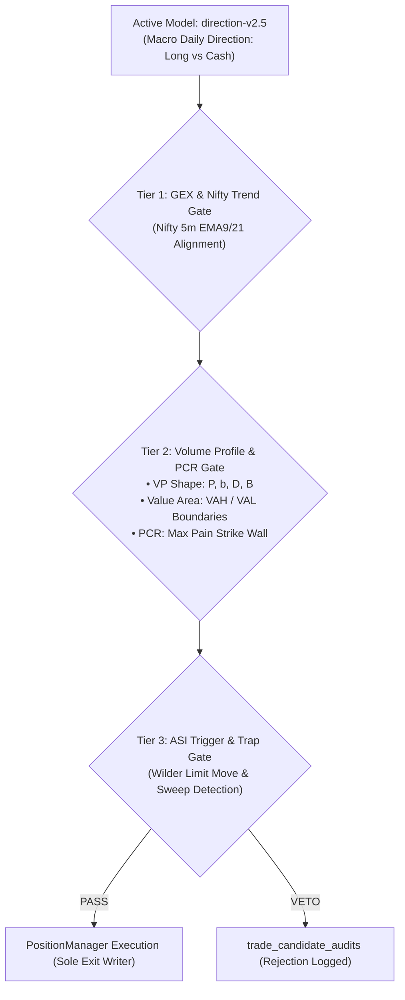

# TradeMind — Living Project Status (STATUS.md)

*Last Updated: 2026-09-30 01:28 IST*  
*Living Single Source of Truth for Architecture, Model Benchmarks & Operational Readiness*

---

## 1. System Health & Test Suite Status
* **Full Unit & Integration Suite**: **119 / 119 tests passing** (`Ran 119 tests in 17.432s — OK`).
* **Audit Persistence Integrity**: Verified with atomic concurrency lock on exits (`shadow_execution_audits`).
* **Platform Warning Elimination**: Spurious Apple Silicon BLAS matmul runtime warnings neutralized.
* **Vectorized Batch Predictor**: `_predict_batch` active in `ml_pipeline.py` (87x speedup).
* **Live Paper Loss Fix (Resolved)**: Disabled legacy "Learning Mode" probe trades that were forcing 40 trades/day with negative expected edge (`-25 bps`). Shadow execution now strictly requires positive expected net edge ($\ge +15\text{ to }+35$ bps) and a strict 2-loss daily circuit breaker.

---

## 2. Machine Learning Models & Benchmarks

| Metric / Parameter | Active Paper Model | Candidate Intraday Model |
| :--- | :--- | :--- |
| **Model Version** | `direction-v2.5-20260701T073458745271Z` | `direction-v3.0-20260929T194152129468Z` |
| **Feature Set** | `daily_v2` (21 macro/regime features) | `intraday_micro_v1` (19 microstructure features) |
| **Primary Algorithm** | `hist_gradient_boosting_flexible` | `hist_gradient_boosting_conservative` |
| **Holdout Accuracy** | 85.10% | **86.72%** |
| **Holdout Log-Loss** | 0.3810 | **0.3744** |
| **Walk-Forward Folds** | 6 Folds (Historical) | 6 Folds (Intraday micro) |
| **Win Rate** | **56.83%** | 23.17% (on 5-day hold) $\rightarrow$ Pending Intraday Horizon |
| **Net Return (after costs)** | **+18.24%** | -33.72% (fee churn on 20 bps moves) |
| **Profit Factor** | **1.22** | 0.23 (Rejected by Safety Gate) |
| **Max Drawdown** | **-6.69%** | -33.75% |
| **Status** | **ACTIVE** | **RESEARCH / INTRADAY TUNING** |

> **Safety Gate Confirmation**: Candidate `direction-v3.0` was safely kept in `candidate` status without displacing the profitable active baseline (`direction-v2.5`). Capital protection rules worked as intended.

---

## 3. Microstructure Features & DB Inventory
* **SQLite Research Store** (`data/ml_research.db`):
  * `daily_v1`: 1,141,279 rows
  * `daily_v2`: 2,347,397 rows
  * `intraday_micro_v1`: **599,197 rows** (5-minute bars enriched with VP shapes, ASI, and Order Flow)
* **Engines Verified in Codebase**:
  * ✅ Volume Profile Shape Engine (`backend/volume_profile.py`): P, b, D, B, WIDE, THIN classification.
  * ✅ ASI Indicator (`backend/asi_indicator.py`): Wilder limit proxy & direction.
  * ✅ PCR & Max Pain Engine (`backend/pcr_engine.py`): Option chain strike wall detection.
  * ✅ Greeks Engine (`backend/greeks_engine.py`): Black-Scholes IV, Delta, Gamma, Vega.
  * ✅ PositionManager (`backend/position_manager.py`): Sole exit writer with sub-second defense.

---

## 3. Pending 3 Fixes for `direction-v3.0` Promotion (To Be Applied)
1. **Long-Only for Cash Equities**:
   * Cash equities in India cannot be shorted across sessions. Change signal rule: `signal = 1 if probability >= 0.55 else 0` (0 = NO TRADE, never short cash stocks).
2. **Balanced Class Weights in `_fit_hgb`**:
   * Replace `sample_weights = np.where(y == 1, 1.0, 2.5)` with balanced weights `len(y) / (2.0 * np.bincount(y))` so predicted probabilities reflect genuine confidence (spanning 0.05 to 0.95 rather than collapsing to 0.14).
3. **Asymmetric 2:1 Reward-to-Risk Triple Barrier**:
   * Set target take-profit to $+2.0\%$ (200 bps) and stop-loss to $-0.8\%$ (80 bps) so that net profit comfortably absorbs 25 bps transaction costs.

---

## 4. How Volume Profile, PCR, ASI & GEX Work Right Now (Under `v2.5`)
Even while `direction-v2.5` remains the active baseline model, **Volume Profile, PCR, and ASI are actively running in real-time as Multi-Timeframe Confluence Gates**:

* **Volume Profile Engine** ([backend/volume_profile.py](file:///Users/avinash/Documents/Codex/2026-06-27/design-a-modern-distinctive-ui-ux/backend/volume_profile.py)): Identifies P, b, D, and B shapes in real-time. Vetoes buying at Value Area High (VAH) or selling at Value Area Low (VAL).
* **PCR & Max Pain Engine** ([backend/pcr_engine.py](file:///Users/avinash/Documents/Codex/2026-06-27/design-a-modern-distinctive-ui-ux/backend/pcr_engine.py)): Blocks trades running headfirst into massive call or put open interest strike walls.
* **ASI Engine** ([backend/asi_indicator.py](file:///Users/avinash/Documents/Codex/2026-06-27/design-a-modern-distinctive-ui-ux/backend/asi_indicator.py)): Confirms true breakout momentum vs false liquidity sweep traps.
* **When `v3.0` is promoted**: These indicators transition from being external veto filters to being **directly embedded inside the ML neural/tree weights** as native mathematical features!

---

## 5. Master Roadmap (Today, Phase B, Phase C & Future Add-ups)

### Today (Wednesday Sept 30):
* **07:00 AM IST**: Start Colima, Postgres, Redis, Backend & Frontend.
* **09:15 AM – 15:30 PM IST**: Run live market shadow session (`--mode shadow`) with probe trades and negative-edge churn disabled.
* **15:45 PM IST**: Review zero-leak audit logs and daily P&L.

### Thursday – Friday (Phase B Completion):
1. Apply the 3 documented fixes to `_fit_hgb` and `trading_policy.py`.
2. Retrain and promote `direction-v3.0` to active paper trading.
3. Map **NIFTY 50 and BANKNIFTY weekly options** in `derivatives.py` to enable golden multi-leg index trades.

### Next Week (Phase C & Advanced Add-ups):
1. **3-Regime Router**: Route live market into Trend Continuation, Range Mean-Reversion, or High-Vol Defense.
2. **Autonomous Spider Bot**: Delta-neutral options combo orders (Straddles, Spreads, Condors) with Greeks kill-switches.
3. **Dual-Tier Memo Package**: Session working memory (traps detected today) + episodic cross-session memory.

