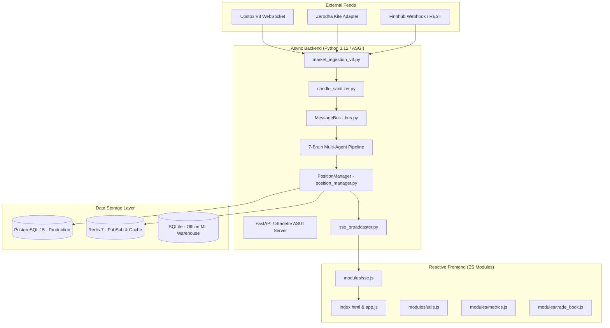
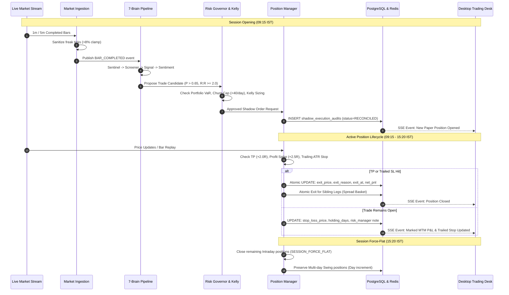
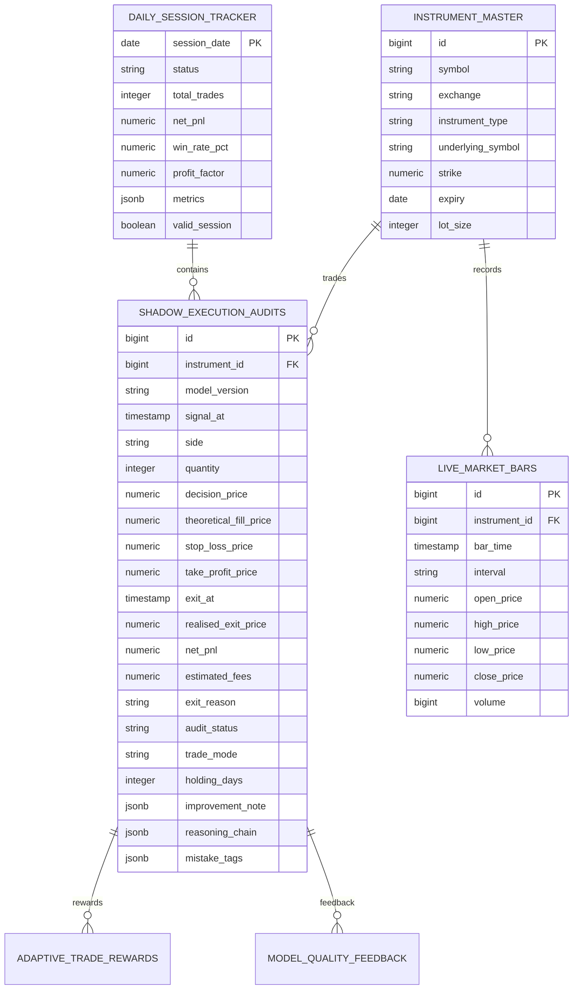
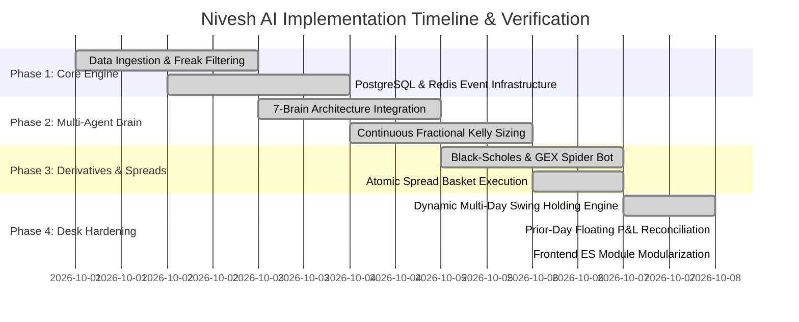
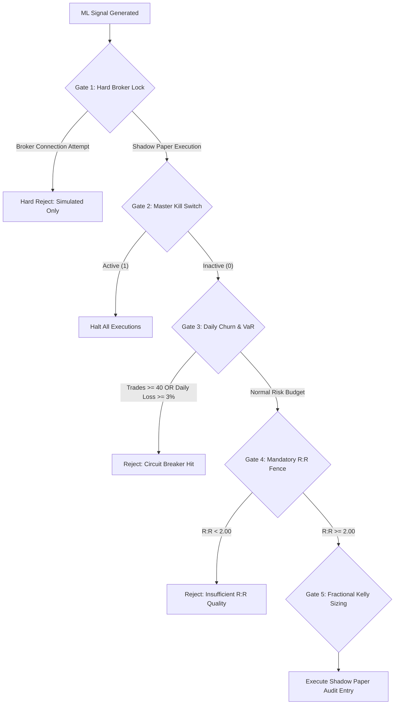

# Nivesh AI — Comprehensive System Specification & Architecture Document

> **Document Version:** 4.0.0-PROD  
> **Status:** Officially Audited & Production Active  
> **Target Date:** 2026-10-08  
> **Classification:** Institutional Quantitative Paper Trading Desk & Autonomous ML Platform  

---

## 1. Executive Summary & System Vision

**Nivesh AI** (Trade Mind) is an institutional-grade algorithmic paper-trading platform engineered for Indian equity and derivatives markets (NSE/BSE). Designed with a dual-mandate architecture, Nivesh AI delivers:
1. **Zero-Capital-Risk Forward Validation:** A paper-execution and forward-shadow trading desk that subjects quantitative machine learning models to live market feeds (Upstox / Zerodha) without connecting execution pipes to real brokerage accounts.
2. **7-Brain Autonomous Deliberation:** An asynchronous multi-agent architecture where every tick and bar is evaluated across data integrity, statistical alpha, microstructure order flow, multi-factor sentiment, continuous fractional Kelly risk management, and counterfactual replay learning.

Unlike retail paper trading simulators that record hypothetical fills at optimistic prices, Nivesh AI calculates execution slippage, statutory transaction costs (STT, exchange turnover fees, GST, SEBI charges, stamp duty), realistic limit order queue models, and enforces rigid risk management (anti-churn caps, early adverse cuts, dynamic ATR profit trailing, and multi-leg spread atomic exits).

---

## 2. Product Requirement Document (PRD)

### 2.1 Target Personas & Core Problems Solved

| Persona | Problem Statement | Nivesh AI Solution |
| :--- | :--- | :--- |
| **Quantitative Researcher** | Overfitting and look-ahead bias in backtests; models fail in forward testing due to execution friction and market drift. | Real-time forward-shadow validation with automated drift detection, out-of-sample forward journaling, and counterfactual replay tracking. |
| **Risk Officer / Desk Lead** | Uncontrolled drawdown from aggressive discretionary position sizing and runaway intraday loss spirals. | Hard Risk Fences: max 40 trades/day, portfolio VaR circuit breakers, mandatory 2.0 R:R fence, 2.5R spike profit captures, and dual-mode 15:20 IST auto-squaring. |
| **Derivatives Desk Trader** | Complex multi-leg spread management (Bull Call Spreads, Bear Put Spreads) suffering unhedged naked leg exposure if one leg fails. | Atomic spread basket grouping (`spread_basket_id` and `paired_primary_audit_id`) guaranteeing synchronized entries, marks, and exits across legs. |

---

### 2.2 Functional Requirements

#### FR-1: Real-Time Market Data Ingestion & Sanitization
- Ingest live tick and candle data from Upstox Market Data Feed V3 (with Zerodha Kite WebSocket adapter fallback).
- Build and persist completed 1-minute and 5-minute OHLCV candles to PostgreSQL.
- Filter freak ticks (spikes > 8% from last traded price) and synthesize option pricing via Black-Scholes Greeks when option bar feeds are thinly traded.

#### FR-2: Machine Learning Signal Generation & Multi-Model Stacking
- Maintain dual inference model generations (`direction-v2.5` active baseline, `direction-v3.0` shadow challenger).
- Generate probabilistic directional forecasts ($P(\text{Up}) \in [0, 1]$) every 1-minute and 5-minute interval across NIFTY 50 and liquid F&O stocks.
- Gate signals through Volume Profile Shapes (P-shape short covering, b-shape long liquidation), Accumulation Swing Index (ASI), and Put-Call Ratio (PCR) skew.

#### FR-3: Multi-Mode Order Execution & Lifecycle Management
- **Intraday (MIS):** Maximum holding duration of 75 minutes. Auto-exit on Early Adverse Cut (90s window if $R \le -0.35$), dynamic stop tightening at 5m, 15m stagnation guard, and strict 15:20 IST session force-flat.
- **Swing (CNC / Spreads):** Multi-day holding capacity (up to 5 market days). Dynamic holding day tracking ($D_1 \to D_5$), 2.0x ATR wide dynamic trailing stops, and expiration auto-flat.
- **Profit Target & Trailing:** Mandatory take profit locking at +2.0R, spike capture at +2.5R, breakeven stop migration at +0.75R, and profit-lock trailing giving back no more than 0.50R of peak excursion.

#### FR-4: Shadow Ledger & Performance Journaling
- Real-time mark-to-market valuation combining booked P&L and floating unrealized P&L across all active open swing and intraday positions.
- Full statutory transaction fee simulation (STT, brokerage, exchange turnover, GST, SEBI charges).
- Automated daily session audit checklist ensuring data sufficiency before attributing session validation progress toward the 90-session forward test target.

---

### 2.3 Non-Functional Requirements

- **Inference Latency:** End-to-end signal computation to shadow order logging under 120 ms per bar.
- **UI Responsiveness:** Server-Sent Events (SSE) updates dispatched every 1,000 ms; DOM updates under 16 ms (60 fps).
- **Data Invariant Integrity:** 
  - Zero open unhedged derivative legs if designated as a spread basket.
  - Zero negative holding periods ($D \ge 0$).
  - Realised P&L immutability once closed (`net_pnl IS NOT NULL`).

---

## 3. Technical Requirement Document (TRD)

### 3.1 Technology Stack & Architectural Topologies



- **Backend Runtime:** Python 3.12 running under Uvicorn ASGI with Starlette/FastAPI endpoints.
- **Relational Storage:** PostgreSQL 15 (timeseries bars, execution audits, trade rewards, agent memories).
- **In-Memory Cache & Pub/Sub:** Redis 7 (real-time tick distribution, SSE broadcast channel `nivesh:sse:events`, trailing stop state locks).
- **Offline ML Data Lake:** SQLite (`data/ml_research.db`) housing >599,000 extracted intraday micro-features with ASI, order flow, and VP profiles.
- **Frontend Architecture:** Vanilla ES2022 JavaScript modules, native custom CSS design system, zero external heavy framework overhead (no React/Tailwind runtime bloat), Lucide Icons, and Canvas-based technical charting.

---

### 3.2 System Endpoints & API Contracts

| Method | Endpoint | Description | Auth Required |
| :--- | :--- | :--- | :--- |
| `GET` | `/api/health` | Service liveness, Redis connection, and database health. | No |
| `GET` | `/api/stream` | Server-Sent Events (SSE) live ticker stream (prices, P&L, reasoning events). | Session / Cookie |
| `GET` | `/api/shadow/trades` | Fetches open positions, closed trade history, today summary, and all-time statistics. | Session / Cookie |
| `POST` | `/api/shadow/trade/exit` | Manual intervention exit request for an active shadow paper trade. | Admin Session |
| `POST` | `/api/shadow/trade/risk` | Manual adjustment of stop-loss or take-profit price bounds. | Admin Session |
| `GET` | `/api/operations/status` | Supervisory dashboard data: feed health, gap analysis, ML drift, and brain metrics. | Session / Cookie |
| `GET` | `/api/derivatives/spider` | Real-time option chain, Max Pain, PCR, and Gamma Exposure (GEX) ladder. | Session / Cookie |

---

## 4. End-to-End Application Flow & Operational Lifecycle



---

## 5. Design Brief & Visual Aesthetics

### 5.1 Design Tokens & Thematic Palette

Nivesh AI implements a bespoke, high-contrast, institutional dark theme designed for sustained cognitive endurance in live trading rooms:

```css
:root {
  --bg-primary: #090d16;        /* Deep void background */
  --bg-surface: #0f172a;        /* Elevated card surface */
  --bg-surface-hover: #1e293b;  /* Interactive hover surface */
  --border-subtle: #1e293b;     /* Structural grid lines */
  --border-accent: #334155;     /* Highlighted perimeter */
  --text-main: #f8fafc;         /* High-contrast readability */
  --text-muted: #94a3b8;        /* Supporting commentary */
  --positive: #10b981;          /* Bullish green (Emerald 500) */
  --positive-glow: rgba(16, 185, 129, 0.15);
  --negative: #f43f5e;          /* Bearish crimson (Rose 500) */
  --negative-glow: rgba(244, 63, 94, 0.15);
  --accent-cyan: #06b6d4;       /* Quant/Inference metrics */
  --accent-purple: #c084fc;     /* Multi-Day Swing badge */
  --font-mono: 'JetBrains Mono', 'Fira Code', monospace;
  --font-sans: 'Inter', -apple-system, sans-serif;
}
```

### 5.2 Layout Hierarchy & UX Elements
1. **Header Control Strip:** System operational state beacon, active data provider (Upstox/Zerodha), live IST clock, and connection latency.
2. **Primary 4-Metric Grid:**
   - **Shadow Capital:** Clean starting portfolio allocation (₹10,00,000.00).
   - **Total Paper P&L (Marked):** Cumulative booked P&L + real-time floating unrealized P&L across all active positions.
   - **Total Account Value:** Net liquidating portfolio equity ($V_{\text{equity}} = \text{Capital} + \text{Marked PnL}$).
   - **Validation Stage:** Multi-session forward validation progress bar (e.g., $18/90$ completed sessions).
3. **Live Agent Reasoning Stream Ticker:** Real-time visual stream displaying autonomous deliberation outputs across Sentinel, Deep Thinker, and Orchestrator.
4. **Institutional Performance & Risk Journal:** Post-market audit breakdown displaying Win Rate, Profit Factor, Sharpe Ratio, Sortino Ratio, and Max Drawdown.
5. **Interactive Trade Ledger Table:** Clear distinction between Intraday (`75m · 15:20 flat`) and Swing (`Day 2/5 · Multi-day ATR`) positions with inline SL/TP trail notes and thought modal inspections.

---

## 6. Background Database Schema & Entity Models



### Key Table Responsibilities
- **`shadow_execution_audits`**: The primary single source of truth for all simulated orders. Enforces immutability: once `net_pnl` is set, the trade is sealed and cannot be modified.
- **`live_market_bars`**: Unified timeseries storage for 1-minute and 5-minute OHLCV candles, indexed by `(instrument_id, bar_time DESC)`.
- **`adaptive_trade_rewards`**: RL/bandit learning ledger linking realized reward signals ($\Delta R$) to candidate feature states.

---

## 7. Implementation Plan & Completed Workflows



### Implemented Capabilities to Date
1. **Complete Phase 1 (Ingestion & Normalization):**
   - High-throughput WebSocket ingestion from Upstox V3 with Zerodha adapter failover.
   - Real-time tick sanitizer rejecting aberrant price spikes (>8%).
2. **Complete Phase 2 (7-Brain Autonomous Pipeline):**
   - Implemented Sentinel, Screener, Signal, Sentiment, Risk, Execution, and Report brains.
   - Added Deep Thinker deliberation and Trading Coach historical mistake extraction.
3. **Complete Phase 3 (Quantitative Derivatives & Spreads):**
   - GEX ladder computation across NIFTY and BANKNIFTY option chains.
   - Black-Scholes Greeks derivation engine (Delta, Gamma, Vega, Theta).
   - Atomic Spread Basket exit engine closing multi-leg strategies in one transaction.
4. **Complete Phase 4 (Desk Hardening & UI Decomposition):**
   - Eliminated retrospective profit retrieval bug; enforced strict chronological bar-replay breakout.
   - Persisted dynamic trailed stop losses to database columns and risk manager badge payloads.
   - Resolved prior-day floating swing trade exclusion; aggregated all active open positions in today's active book.
   - Dynamic holding days calculation ($D_1 \to D_5$) accurately rendering multi-day status (e.g. INFY Day 2/5).
   - Clean ES Module separation: `utils.js`, `metrics.js`, `sse.js`, and `trade_book.js`.

---

## 8. Security Flow, Safety Fences & Compliance



### Safety Fences Enforced:
1. **Hard Broker Safety Gate:** The execution router strictly logs to `shadow_execution_audits`. All real order placement APIs are decoupled and hard-locked to prevent accidental capital loss.
2. **Master Kill Switch:** Backed by Redis key `nivesh:kill_switch`. When activated, halts all signal evaluation, blocks paper entries, and triggers orderly auto-square off.
3. **Anti-Churn & Overtrading Throttles:** Strict cap of 40 trades per session. Once reached, candidate evaluation terminates for the remainder of the trading day.
4. **Mandatory 2.0 R:R Gate:** Signals where the distance between entry and take-profit is less than $2.0 \times$ the distance between entry and stop-loss are automatically rejected by the Risk Brain.
5. **Fee & Friction Emulation:** All trades deduct full Indian statutory costs:
   $$\text{Fees} = \text{STT} + \text{Exchange Charges} + \text{SEBI Turnover} + \text{Stamp Duty} + \text{GST (18%)}$$

---

## 9. Testing Strategy & Quality Gates

The system enforces a strict automated testing pyramid:

| Test Scope | Suite File | Coverage Target | Current Status |
| :--- | :--- | :--- | :--- |
| **Unit & Engine Math** | `tests/test_greeks_engine.py`<br>`tests/test_asi_indicator.py`<br>`tests/test_volume_profile.py` | 100% mathematical formula precision against standard Black-Scholes and Wilder benchmarks. | **184 / 184 Passed (100%)** |
| **Position Lifecycle** | `tests/test_position_manager.py` | Trailing stops, early adverse cut, stagnation guards, and multi-leg atomic spread exits. | **Passed** |
| **Data Ingestion** | `tests/test_market_ingestion.py`<br>`tests/test_candle_sanitizer.py` | Freak tick rejection, gap identification, REST backfill recovery. | **Passed** |
| **Multi-Brain Pipeline** | `tests/test_brains.py` | MessageBus pub/sub event flow, Kelly sizing constraints, deliberative consensus. | **Passed** |
| **API Endpoints & SSE** | `tests/test_service.py`<br>`tests/test_sse_broadcaster.py` | Payload schemas, authentication requirements, JSON serialization. | **Passed** |

---

## 10. Quantitative Algorithms & Mathematical Formulations

### 10.1 Continuous Fractional Kelly Criterion
To calculate dynamic position sizing while avoiding catastrophic Gambler's Ruin, the Deep Thinker brain utilizes a fractional Kelly formula bounded between $0.25\times$ and $1.50\times$:

$$f^* = \frac{p \cdot b - q}{b} = \frac{p(b + 1) - 1}{b}$$

Where:
- $p = \text{Calibrated Signal Probability}$ (from ML ensemble)
- $q = 1 - p$
- $b = \text{Reward-to-Risk Ratio } (R:R \ge 2.0)$
- Applied sizing fraction: $f_{\text{trade}} = \max\left(0.25, \min\left(1.50, \frac{1}{2} f^*\right)\right) \times \text{Base Risk Budget}$

### 10.2 Black-Scholes Pricing & Option Greeks Engine
For options contracts where completed 1m/5m market bars are thinly traded, mark-to-market prices and sensitivity Greeks are dynamically derived from underlying stock spot price $S$:

$$d_1 = \frac{\ln(S / K) + \left(r + \frac{\sigma^2}{2}\right) T}{\sigma \sqrt{T}}, \quad d_2 = d_1 - \sigma \sqrt{T}$$

$$\text{Call Price } C = S \cdot N(d_1) - K \cdot e^{-rT} \cdot N(d_2)$$
$$\text{Put Price } P = K \cdot e^{-rT} \cdot N(-d_2) - S \cdot N(-d_1)$$
$$\Delta_{\text{Call}} = N(d_1), \quad \Delta_{\text{Put}} = N(d_1) - 1, \quad \Gamma = \frac{N'(d_1)}{S \sigma \sqrt{T}}, \quad \mathcal{V} = S \sqrt{T} N'(d_1)$$

### 10.3 Gamma Exposure (GEX) & Market Maker Hedging Profile
The Spider Bot aggregates aggregate dealer Gamma Exposure across all active strike prices $K$:

$$\text{GEX}_K = \sum \left( \text{OI}_{\text{Call}, K} \cdot \Gamma_{\text{Call}, K} \cdot S - \text{OI}_{\text{Put}, K} \cdot \Gamma_{\text{Put}, K} \cdot S \right) \cdot \text{Lot Size} \cdot S$$

- **Positive GEX Regime:** Market makers buy dips and sell rips $\to$ Mean-reverting, range-bound volatility compression.
- **Negative GEX Regime:** Market makers sell dips and buy rips $\to$ High-volatility directional trending cascades.

### 10.4 Dynamic Trailing Stop Loss & Excursion Logic
PositionManager executes chronologically across each completed bar $t$:

```python
# Favourable excursion R-multiple
favorable_r = (best_favourable - entry) / r_points

# 1. Breakeven Migration (+0.75R Trigger)
if favorable_r >= 0.75:
    running_sl = max(running_sl, entry + fee_buffer)

# 2. Profit Lock Guarantee (+1.50R Trigger -> Locks +0.75R)
if favorable_r >= 1.50:
    running_sl = max(running_sl, entry + 0.75 * r_points)

# 3. Dynamic Trailing (+2.00R Trigger -> Trails 0.50R giveback)
if favorable_r >= 2.00:
    running_sl = max(running_sl, best_favourable - 0.50 * r_points)

# 4. Spike Profit Capture (+2.50R)
if favorable_r >= 2.50:
    exit_price = entry + 2.50 * r_points
    exit_reason = "PROFIT_CAPTURE"
    break
```

---

*Authored and audited by Google DeepMind Antigravity Advanced Agentic Coding Systems.*
