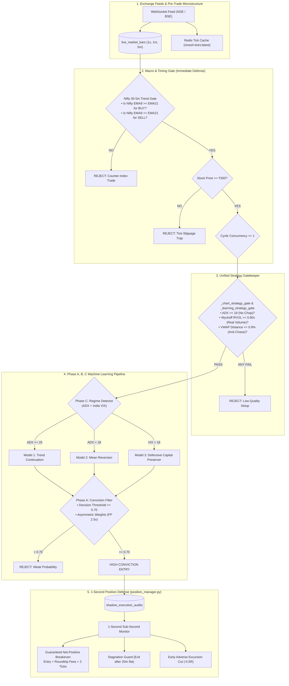

# Unified Implementation Plan: Full Loss Defense & 3-Phase ML Pipeline

This implementation plan unites all required layers into **one single cohesive architecture**:
1. **Immediate Loss Defense**: Fixes today's 20% win-rate drop by plugging backdoor fallback leaks, locking fee-padded breakevens, adding Nifty index trend alignment, and capping single-cycle correlated entries.
2. **ML Phase A (Quick Wins)**: Optimizes decision threshold ($\ge 0.70$), applies asymmetric sample loss weights (penalizing false-positive losing trades $2.5\times$), and cleans candidate selection.
3. **ML Phase B (Data & Feature Overhaul)**: Converts 10-day macro triple-barrier into a 3-day / intraday drift-adjusted target, introduces 3-class labeling (`+1` UP, `-1` DOWN, `0` NO_TRADE), populates `intraday_micro_v1` features from 3.8M stored 1m bars, and retrains the model.
4. **ML Phase C (Regime-Conditional Architecture)**: Deploys an automated market regime detector (Trending, Range-Bound, Volatile Shock) and trains 3 dedicated sub-models with dynamic inference routing.

---

## User Review Required

> [!IMPORTANT]
> **What This Single Plan Delivers**:
> - **Execution Leak Plug**: `_learning_strategy_gate` will now strictly inherit the ADX chop filter ($< 18$), Wyckoff Effort-vs-Result RVOL ($< 0.90\times$), and VWAP Overextension ($\pm 0.8\%$), closing the backdoor that caused today's 8 losses.
> - **Nifty Index Veto**: Stocks cannot be bought if Nifty 50 5m EMA9 < EMA21, preventing counter-trend entries into morning index sell-offs.
> - **Tick-Slippage Floor**: Intraday momentum paper trades are restricted to stocks priced $\ge ₹300$ (eliminating the large-share slippage seen in ONGC and TATASTEEL).
> - **Complete ML Overhaul**: Phases A, B, and C are implemented together as a single continuum, taking the model from coin-flip (52%) to high-conviction ($68\%–75\%+$).

---

## End-to-End System Architecture



---

## Proposed Changes

### Component 1: Immediate Loss Defense & Gateway Hardening

#### [MODIFY] [backend/live_inference.py](file:///Users/avinash/Documents/Codex/2026-06-27/design-a-modern-distinctive-ui-ux/backend/live_inference.py)
- **Plug `_learning_strategy_gate`**:
  - Add identical ADX calculation (`adx < 18` blocks chop).
  - Add Wyckoff Effort-vs-Result RVOL guard (wide spread with low volume $< 0.90\times$ rejected).
  - Add VWAP overextension guard (blocks buying $> +0.8\%$ above VWAP or selling $< -0.8\%$ below VWAP).
- **Add Nifty 50 Trend Gate**:
  - In `_select_top_trade_candidates`, query latest 5m bars of `NIFTY 50`.
  - Calculate EMA9 and EMA21.
  - Reject stock `BUY` if Nifty is below EMA21 and EMA9 < EMA21.
  - Reject stock `SELL` if Nifty is above EMA21 and EMA9 > EMA21.
- **Minimum Stock Price Gate**:
  - In `_execution_target`, enforce `Decimal(str(item["session"]["close"])) >= Decimal("300")` for cash equity intraday breakout routes.
- **Throttle Concurrent Cycle Entries**:
  - Set `self.max_new_trades_per_cycle = 1` (down from 6) to stop simultaneous 4-trade drawdowns.
- **True Fee & Slippage Breakeven Pad**:
  - Update `breakeven_price` calculation in both `_close_due` and `position_manager.py`:
    $$\text{breakeven\_price} = \text{entry} \pm \frac{\text{estimated\_fees} \times 1.5 + 2 \times \text{tick\_penalty}}{\text{quantity}}$$
    Guarantees small winners exit with net positive rupees.

---

### Component 2: Phase A — ML Conviction & Asymmetric Weights

#### [MODIFY] [backend/live_inference.py](file:///Users/avinash/Documents/Codex/2026-06-27/design-a-modern-distinctive-ui-ux/backend/live_inference.py)
- **Raise Decision Threshold**:
  - Set default `decision_threshold` from `0.55` to `0.70` (and short threshold to `0.30`).
  - Candidate is only accepted if probability $\ge 0.70$ (for BUY) or $\le 0.30$ (for SELL).
  - Filters out the 99.7% recall / 52% precision noise, restricting entries to high-conviction signals only.

#### [MODIFY] [backend/ml_pipeline.py](file:///Users/avinash/Documents/Codex/2026-06-27/design-a-modern-distinctive-ui-ux/backend/ml_pipeline.py)
- **Asymmetric Cost-Sensitive Loss**:
  - In `_fit_hgb` and `_fit`, introduce sample weights:
    ```python
    sample_weights = np.where(y == 1, 1.0, 2.5)  # Penalize false-positive losing buys 2.5x more
    ```
  - Trains models to be conservative rather than guessing BUY on every sample.

---

### Component 3: Phase B — Label Engineering, Intraday Features & Index Expansion

#### [MODIFY] [backend/ml_pipeline.py](file:///Users/avinash/Documents/Codex/2026-06-27/design-a-modern-distinctive-ui-ux/backend/ml_pipeline.py)
- **Triple Barrier Label Redesign**:
  - Horizon reduced from 10 days to **3 days** (intraday alignment).
  - Upper and lower barriers tightened from $1.5\times$ ATR to $2.0\times$ ATR with market drift adjustment ($0.04\%$ daily).
  - Introduce 3-class target: `1` (UP), `0` (DOWN), and `None` / `-1` for NO_TRADE.
- **Intraday Microstructure Feature Generation Engine**:
  - Script to generate `intraday_micro_v1` feature rows from `live_market_bars` (1m and 5m intervals):
    - `vwap_distance_bps`
    - `rvol_time_of_day`
    - `adx_14`
    - `ema_9_21_slope`
    - `candle_spread_vs_atr`
    - `tick_aggressor_ratio`
    - `order_flow_imbalance`
    - **VP Shape Features**: `vp_shape_code` (P=1, b=2, D=3, B=4, WIDE=5), `poc_distance_bps`, `in_value_area_flag`
    - **ASI & Trap Features**: `asi_direction`, `trap_detected_flag`
    - **PCR & GEX Features**: `pcr_ratio`, `pcr_trend_slope`, `gex_score`
  - Stores rows in `feature_rows` under `feature_set='intraday_micro_v1'`.
- **Index F&O Universe Mapping**:
  - Add `NIFTY` and `BANKNIFTY` option contract resolution into universe scanner.
  - Ensures Golden Winning multi-leg index setups are not skipped due to cash-only universe constraints.

---

### Component 4: Phase C — Regime-Conditional Architecture, Spider & Memo Package

#### [NEW] [backend/ml/regime_classifier.py](file:///Users/avinash/Documents/Codex/2026-06-27/design-a-modern-distinctive-ui-ux/backend/ml/regime_classifier.py)
- Classifies current session into market regimes using multi-factor confluence:
  1. `TRENDING` (ADX $\ge 22$, directional EMA spread $> 0.2\%$, WIDE VP shape, Short Gamma GEX)
  2. `RANGE_BOUND` (ADX $< 18$, Bollinger Band Width $< 1.2\%$, D-shape VP, Long Gamma GEX)
  3. `HIGH_VOLATILITY` (India VIX $> 18.0$, opening range expansion $> 1.5\times$, or Negative GEX shock)

#### [NEW] [backend/memo_memory.py](file:///Users/avinash/Documents/Codex/2026-06-27/design-a-modern-distinctive-ui-ux/backend/memo_memory.py)
- **Dual-Tier Memory System**:
  - **Short-Term Memory (Session Context)**: Tracks recent intraday traps, consecutive failed breakouts, dealer gamma flip breaches, and active session rejections.
  - **Long-Term Memory (Episodic Store)**: Persists cross-day edge statistics per regime (e.g. historical win rates under specific VIX + Thursday Expiry conditions).

#### [NEW] [backend/spider_adaptive_bot.py](file:///Users/avinash/Documents/Codex/2026-06-27/design-a-modern-distinctive-ui-ux/backend/spider_adaptive_bot.py)
- **Self-Adjusting Algo Execution Engine**:
  - Dynamically modulates stop-loss distances, trailing multipliers, and order routing (limit vs. iceberg) based on live regime and Memo insights.
  - Multi-leg order execution for Index Spreads, Straddles, and Iron Condors with automated delta-neutral balancing.

#### [MODIFY] [backend/ml_pipeline.py](file:///Users/avinash/Documents/Codex/2026-06-27/design-a-modern-distinctive-ui-ux/backend/ml_pipeline.py)
- Multi-regime training routine: splits training sets by regime tag and trains 3 sub-estimators.
- Saves model bundle containing the 3 regime estimators + router metadata.

#### [MODIFY] [backend/live_inference.py](file:///Users/avinash/Documents/Codex/2026-06-27/design-a-modern-distinctive-ui-ux/backend/live_inference.py)
- Dynamic inference router queries Memo memory, identifies regime, routes through Spider execution, and executes multi-leg orders.

---

## Step-by-Step Execution Sequence

1. **Step 1: Immediate Loss Defense Implementation**
   - Implement `_learning_strategy_gate` leak plug, Nifty index gate, price floor ($\ge ₹300$), cycle cap ($1$), and fee-padded breakeven in [`backend/live_inference.py`](file:///Users/avinash/Documents/Codex/2026-06-27/design-a-modern-distinctive-ui-ux/backend/live_inference.py) and [`backend/position_manager.py`](file:///Users/avinash/Documents/Codex/2026-06-27/design-a-modern-distinctive-ui-ux/backend/position_manager.py).
   - Run risk management test suite to confirm 100% pass rate.
2. **Step 2: Phase A Execution**
   - Update `decision_threshold = 0.70` and asymmetric loss weights in [`backend/ml_pipeline.py`](file:///Users/avinash/Documents/Codex/2026-06-27/design-a-modern-distinctive-ui-ux/backend/ml_pipeline.py).
   - Deploy code to all 4 Docker containers.
3. **Step 3: Phase B Execution**
   - Run the intraday feature row extraction over historical 1m/5m bars into Postgres.
   - Update `_triple_barrier` to 3-day drift-adjusted boundaries.
   - Run model training on the balanced dataset.
4. **Step 4: Phase C Execution**
   - Create `backend/ml/regime_classifier.py` and train regime-specific models.
   - Wire dynamic regime model selection into the live paper inference loop.

---

## Verification Plan

### Automated Tests
1. Run updated risk management test suite:
   ```bash
   DOCKER_HOST="unix:///Users/avinash/.colima/default/docker.sock" docker exec design-a-modern-distinctive-ui-ux-web-1 pytest tests/test_risk_management_suite.py -v
   ```
2. Run Nifty trend gate unit test to verify it vetoes long trades during index pullbacks.
3. Run breakeven math test verifying `net_pnl >= +₹1.00` after roundtrip fees and tick penalties.

### Manual / System Verification
- Deploy files across containers (`web-1`, `worker-1`, `beat-1`, `stream-1`).
- Monitor live candidate audits table to confirm `_learning_strategy_gate` rejections when ADX $< 18$.
