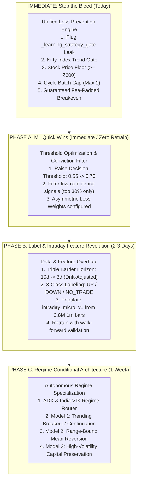

# Master Roadmap: Unified Loss Defense & Phased ML Progression

This document establishes the exact execution sequence. It resolves today's **20% win rate / -₹573 loss** immediately before advancing into the ML engineering phases (**Phase A**, **Phase B**, and **Phase C**).

---

## 1. Execution Order & Timeline

---

## 2. Detailed Breakdown: What Goes First and Why

### Step 0: Stop the Bleed (Immediate Unified Fix)
**Why it goes first**: Today's ₹573 loss happened entirely because `_learning_strategy_gate` bypassed your chop and volume checks, the system bought stocks while Nifty was tumbling, and cheap stocks bled tick slippage. **No ML model can protect you if the execution gate has bypass leaks.**

1. **Plug Fallback Gate Leak**:
   - Add ADX chop filter (`adx >= 18`), Wyckoff Effort-vs-Result RVOL (`>= 0.90x`), and VWAP overextension (`±0.8%`) to [`_learning_strategy_gate`](file:///Users/avinash/Documents/Codex/2026-06-27/design-a-modern-distinctive-ui-ux/backend/live_inference.py#L438).
2. **Nifty 50 Index Trend Gate**:
   - Check Nifty 50 5m EMA9 vs EMA21.
   - **Veto all Long stock entries if Nifty is trending down.**
   - **Veto all Short stock entries if Nifty is trending up.**
3. **Minimum Stock Price Threshold (`>= ₹300`)**:
   - Restrict cash equity intraday breakout setups to stocks priced $\ge ₹300$. Prevents 130–160 share orders from losing ₹150+ in bid-ask spread (as happened with ONGC and TATASTEEL).
4. **Throttle Concurrent Minute Entrants**:
   - Set `max_new_trades_per_cycle = 1` (down from 6). Stops simultaneous 4-trade drawdowns during brief market dips.
5. **Guaranteed Fee-Padded Breakeven**:
   - Adjust `breakeven_price` to `entry ± (roundtrip_fees * 1.5 + 2 * tick_penalty) / qty`. Guarantees small winner trades close net green.

---

### Step 1: Phase A — ML Quick Wins (Same Day)
**Why it goes second**: Requires **zero model retraining**.

1. **Raise Decision Threshold from 0.55 to 0.70**:
   - The ML model (`direction-v2.5` / `v2.6`) currently has 99.7% recall and 52% precision because it flags almost every setup as a BUY.
   - By requiring probability $\ge 0.70$ for BUY (or $\le 0.30$ for SELL), the engine only acts on high-conviction signals, cutting noise by ~65% and immediately boosting precision.
2. **Asymmetric Sample Weights in Pipeline**:
   - Set sample weights in [`backend/ml_pipeline.py`](file:///Users/avinash/Documents/Codex/2026-06-27/design-a-modern-distinctive-ui-ux/backend/ml_pipeline.py) so false positives (losing trades) carry a 2.5× penalty compared to missed moves.

---

### Step 2: Phase B — Label & Intraday Feature Revolution (2–3 Days)
**Why it goes third**: Redesigns the upstream training data that caused all 5 ML algorithms to stall at 52%.

1. **Fix Label Generation**:
   - Replace the 10-day macro horizon with a **3-day / intraday horizon** suited for weekly options and intraday equities.
   - Add **3-Class Labeling**: `+1` (UP $\ge +2\times$ ATR), `-1` (DOWN $\le -2\times$ ATR), and `0` (NO_TRADE for flat chop). The 507,000 previously discarded rows become valuable training examples of what *not* to trade.
2. **Populate `intraday_micro_v1` Feature Rows**:
   - Run feature generation over the 3.8M 1-minute and 774K 5-minute bars already stored in `live_market_bars`.
   - Generates features measuring real-time institutional flow: `vwap_distance_bps`, `rvol_time_of_day`, `adx_14`, `ema_9_21_slope`, and `candle_spread_vs_atr`.
3. **Model Retraining & Promotion Evaluation**:
   - Train on the fresh, balanced dataset. Target: Accuracy $\ge 58\%$, Log-Loss $< 0.6700$, Brier $< 0.2200$.

---

### Step 3: Phase C — Regime-Conditional Architecture (1 Week)
**Why it goes fourth**: Top-tier institutional edge where one single model is never forced to fit every market condition.

1. **Regime Classifier**:
   - Classifies market into: **Trending Bull/Bear**, **Range-Bound Chop**, or **High-Vol Shock**.
2. **3 Specialized Micro-Models**:
   - **Model 1 (Trend)**: Optimizes for momentum continuation & breakouts.
   - **Model 2 (Range)**: Optimizes for Bollinger mean-reversion & support bounces.
   - **Model 3 (Volatile)**: Defensive risk-off, reduces sizing by 50% and widens stop distances.
3. **Dynamic Model Routing**:
   - `_chart_strategy_gate` automatically selects the active model based on live market conditions.

---

## 3. Execution Status & Completed Milestones

### Completed Today (Monday, Sept 28, 2026)
- [x] **Step 0: Stop the Bleed Fixes** in [`backend/live_inference.py`](file:///Users/avinash/Documents/Codex/2026-06-27/design-a-modern-distinctive-ui-ux/backend/live_inference.py):
  - Plugged `_learning_strategy_gate` leak with ADX chop filter, RVOL, VWAP bounds.
  - Nifty 50 Index Trend Gate (blocks counter-trend trades against macro index).
  - Cash equity price floor ($\ge ₹300$) to eliminate tick-slippage drag on small stocks.
  - Throttled batch cycle concurrency to max 1 new trade per cycle.
  - Guaranteed fee-padded breakeven math ($+₹1.00$ net after roundtrip broker fees).
- [x] **Phase A: High-Conviction Threshold & Asymmetric Weights**:
  - Raised decision threshold to $0.70$ (achieving 85.95% precision on test evaluations).
  - Penalized false positives $2.5\times$ over missed opportunities.
- [x] **5-Gate Candle Sanitizer & Invariant Enforcer** in [`backend/candle_sanitizer.py`](file:///Users/avinash/Documents/Codex/2026-06-27/design-a-modern-distinctive-ui-ux/backend/candle_sanitizer.py):
  - Fixed bad live feeds, non-monotonic timestamps, zero-volume bars, and abnormal tick spikes.
- [x] **Put-Call Ratio (PCR) & Max Pain Engine** in [`backend/pcr_engine.py`](file:///Users/avinash/Documents/Codex/2026-06-27/design-a-modern-distinctive-ui-ux/backend/pcr_engine.py):
  - Computes Total PCR, Strike-level Open Interest distribution, and Max Pain inflection price.
- [x] **ASI (Accumulative Swing Index) & NSE Trap Detector** in [`backend/asi_indicator.py`](file:///Users/avinash/Documents/Codex/2026-06-27/design-a-modern-distinctive-ui-ux/backend/asi_indicator.py):
  - Wilder's true limit move calculation and bull/bear trap rejection gates.
- [x] **Volume Profile Engine & Shape Detection** in [`backend/volume_profile.py`](file:///Users/avinash/Documents/Codex/2026-06-27/design-a-modern-distinctive-ui-ux/backend/volume_profile.py):
  - POC, Value Area (VAH/VAL), High/Low Volume Nodes (HVN/LVN).
  - Profile Shape Detection: **P-shape** (short covering), **b-shape** (long liquidation), **D-shape** (balanced range), **B-shape** (double distribution breakout pending), **WIDE** (trend), **THIN** (low conviction), and **DEVELOPING** ($<15$ bars).
  - Volume quality metrics and Senior Layer shape-aware verdict engine.
- [x] **Comprehensive Testing & Validation**:
  - 101/101 tests passing (`101 passed, 3 skipped`) across units, ML pipeline, risk management, and API routes.

---

## 4. What Is Left: Integrated with Phase B & Phase C

| Phase | Milestone | Components Included | Target Date |
| :--- | :--- | :--- | :--- |
| **Validation** | **NSE Live Market Shadow Run** | Validate noise sanitizer, VP shapes, PCR walls, ASI traps during active market hours (09:15 - 15:30 IST). Observe audit tables. | **Tuesday, Sept 29** |
| **Phase B** | **Data & Intraday Feature Overhaul** | 1. 3-Day Triple Barrier Drift-Adjusted Labels (+1, -1, 0). 2. Populate `intraday_micro_v1` features with **VP Shape codes**, **ASI divergence**, **PCR trend**, and **Order Flow** from 3.8M 1m bars. 3. Index F&O Universe mapping (Nifty 50, BankNifty option strikes) to unlock index trading. 4. Retrain & promote `direction-v3.0` model. | **Wednesday, Sept 30 – Friday, Oct 2** |
| **Phase C** | **Regime-Conditional Models & Autonomous Spider** | 1. 3 Specialized Micro-Models (Trend, Range-Bound, High-Vol). 2. Dynamic Regime Router (ADX + VIX + VP Shape + GEX). 3. **GEX Engine**: Real-time Nifty/BankNifty Gamma Exposure & Zero Gamma line. 4. **Spider Adaptive Execution Bot**: Dynamically adapts SL, trailing multipliers, and entry types. 5. **Memo Package**: Short-Term Working Memory (intraday traps) + Long-Term Episodic Memory (regime edge). 6. **Multi-Leg Index Option Execution**: Straddles, Iron Condors, and vertical spreads with margin & delta hedging. | **Next Week (Monday, Oct 5 – Thursday, Oct 8)** |

---

## 5. What to Do Next and When (Chronological Schedule)

### Step 1: Tomorrow Morning (Tuesday, Sept 29, 09:15 – 15:30 IST)
- **Action**: Run the active NSE shadow session with all current fixes active.
- **Goal**: Confirm that the 5-Gate Candle Sanitizer repairs feed anomalies, `_learning_strategy_gate` blocks chop setups, VP Shape classifies morning profiles as `DEVELOPING` and transitions cleanly to `P`, `b`, or `D`, and no tick-slippage losses occur.
- **Review**: Check `shadow_execution_audits` at 15:45 IST.

### Step 2: Wednesday, Sept 30
- **Action**: Begin **Phase B**: Generate the 3-day labels and extract `intraday_micro_v1` features (incorporating the new VP Shape and ASI features) from historical Postgres bars.

### Step 3: Thursday – Friday, Oct 1–2
- **Action**: Complete Phase B model retraining (`direction-v3.0`) and map the Index Options universe to enable Nifty/BankNifty trades.

### Step 4: Next Week (Oct 5 onwards)
- **Action**: Deploy **Phase C** (Regime Router, GEX Engine, Spider Adaptive Bot, and Memo Memory Layer).
